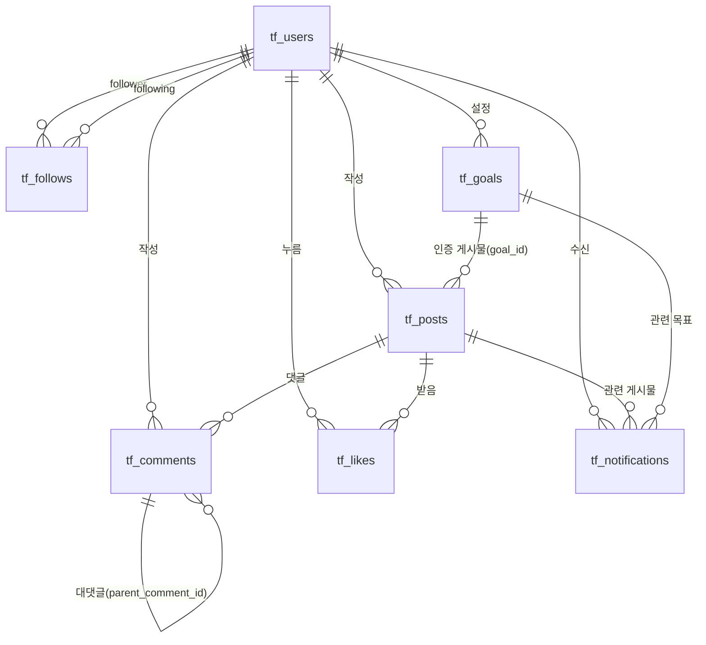

# DB 구조 기획서 — 트랙핏(TrackFit)

> 이 문서는 `기획서.txt`(모바일 서비스 UI 기획서)를 기준으로 검토·보완되었습니다.
> 모든 테이블 이름 앞에는 서비스 이름 트랙핏(TrackFit)의 약자인 `tf_`를 붙입니다.
> `[수정]` `[신규]` 표시는 원래의 `DB 구조 기획서.txt`에서 이번 검토로 바로잡거나 추가한 부분입니다.

## 목차
1. [tf_users — 사용자 정보](#1-tf_users--사용자-정보)
2. [tf_posts — 게시물 정보](#2-tf_posts--게시물-정보)
3. [tf_comments — 댓글 정보](#3-tf_comments--댓글-정보)
4. [tf_likes — 좋아요 정보](#4-tf_likes--좋아요-정보)
5. [tf_follows — 팔로우 정보](#5-tf_follows--팔로우-정보)
6. [tf_goals — 목표 정보](#6-tf_goals--목표-정보)
7. [tf_notifications — 알림 정보](#7-tf_notifications--알림-정보)
8. [테이블 연결 관계 (ERD)](#8-테이블-연결-관계-erd)
9. [검토 필요 항목 정리](#9-검토-필요-항목-정리)

---

## 1. tf_users — 사용자 정보

SNS 로그인/프로필 화면에서 필요한 정보.

| 필드명 | 타입 | 제약 | 설명 |
|---|---|---|---|
| id | INT | PK, 자동증가 | 사용자 번호 |
| username | VARCHAR | UNIQUE | `@`로 표시되는 고유 아이디 |
| email | VARCHAR | UNIQUE | 로그인에 사용하는 이메일 |
| password_hash | VARCHAR | NOT NULL | 비밀번호 — **[수정]** 평문이 아닌 해시(bcrypt 등)로 저장 |
| display_name | VARCHAR | NOT NULL | 프로필에 보이는 실제 이름 |
| bio | TEXT | NULL 허용 | 자기소개 |
| profile_image_url | VARCHAR | NULL 허용 | 프로필 이미지 경로 |
| birth_date | DATE | NOT NULL | **[신규]** 생년월일 — 만 14세 미만 가입 금지 검증용 |
| followers_count | INT | DEFAULT 0 | **[신규]** 팔로워 수 캐시 |
| following_count | INT | DEFAULT 0 | **[신규]** 팔로잉 수 캐시 |
| is_active | BOOLEAN | DEFAULT TRUE | **[신규]** 회원 탈퇴용 소프트 삭제 플래그 |
| created_at | TIMESTAMP | NOT NULL | 가입일 |
| updated_at | TIMESTAMP | NOT NULL | **[신규]** 정보 수정일 |

---

## 2. tf_posts — 게시물 정보

SNS 피드 화면에서 필요한 정보.

| 필드명 | 타입 | 제약 | 설명 |
|---|---|---|---|
| id | INT | PK, 자동증가 | 게시물 고유번호 |
| user_id | INT | FK → `tf_users.id` | 작성자 |
| caption | TEXT | NULL 허용 | 사진에 쓴 글 내용 |
| image_url | VARCHAR | NOT NULL | 선택한 Unsplash 이미지 URL |
| workout_type | VARCHAR | NOT NULL | **[수정: tf_comments에서 이동]** 운동 종목 |
| workout_duration | INT | NOT NULL (분 단위) | **[수정: tf_comments에서 이동]** 운동 시간 |
| workout_distance | DECIMAL | NULL 허용 | **[수정: tf_comments에서 이동]** 운동 거리(없을 수 있음) |
| workout_latitude | DECIMAL | NULL 허용 | **[수정 + 세분화]** 운동 위치 - 위도 |
| workout_longitude | DECIMAL | NULL 허용 | **[수정 + 세분화]** 운동 위치 - 경도 |
| location_name | VARCHAR | NULL 허용 | **[신규]** 장소 이름("한강공원" 등), 장소별 모아보기용 |
| goal_id | INT | FK → `tf_goals.id`, NULL 허용 | **[신규]** 이 게시물이 인증하는 목표 |
| visibility | ENUM | `public`/`followers`/`private`, DEFAULT `public` | **[신규]** 공개 범위 |
| likes_count | INT | DEFAULT 0 | 좋아요 수 캐시 (실제 기록은 `tf_likes`) |
| comments_count | INT | DEFAULT 0 | **[신규]** 댓글 수 캐시 |
| shares_count | INT | DEFAULT 0 | 공유 수 |
| created_at | TIMESTAMP | NOT NULL | 작성일 |
| updated_at | TIMESTAMP | NOT NULL | **[신규]** 수정일 (게시물 수정 기능용) |

### 게시물 작성 방식 (변경 없음)
1. 내용(캡션) 입력
2. Unsplash API로 랜덤 이미지 여러 개 표시
3. 마음에 드는 이미지 선택 (새로고침으로 다른 랜덤 이미지 재조회 가능)
4. 선택한 이미지 링크를 `tf_posts.image_url`에 저장

> 운동 종목/시간/거리/위치, 목표 연결, 공개 범위도 이 작성 단계에서 함께 입력받아야 합니다. (기존 서술에는 캡션·이미지만 언급되어 있었음)

> ⚠ **이미지 방식 불일치**: 이 문서는 "Unsplash 이미지 1장 선택"을 전제로 하는데, UI 기획서(`기획서.txt`) 5번 페이지는 "사진/영상 업로드(다중 선택)"로 되어 있어 서로 어긋납니다. (A) Unsplash 단일 이미지로 통일하거나 (B) 실제 다중 업로드를 지원할 `tf_post_images`(post_id, image_url, sort_order) 테이블을 분리해야 합니다. 결정 전까지는 현재 구조(Unsplash 단일 이미지)를 유지합니다.

---

## 3. tf_comments — 댓글 정보

게시물 댓글을 위한 정보.

| 필드명 | 타입 | 제약 | 설명 |
|---|---|---|---|
| id | INT | PK, 자동증가 | 댓글 번호 |
| content | TEXT | NOT NULL | 댓글 내용 |
| user_id | INT | FK → `tf_users.id` | 댓글 작성자 |
| post_id | INT | FK → `tf_posts.id` | 댓글이 달린 게시물 |
| parent_comment_id | INT | FK → `tf_comments.id`, NULL 허용 | **[신규]** 대댓글의 부모 댓글 (NULL이면 최상위 댓글) |
| created_at | TIMESTAMP | NOT NULL | 댓글 작성일 |

> **[수정]** 기존에 이 테이블에 잘못 들어가 있던 "운동 종목 / 운동 시간 / 운동 거리 / 운동 위치(GPS)" 4개 필드는 댓글과 무관한 정보라 `tf_posts` 테이블로 옮겼습니다.

---

## 4. tf_likes — 좋아요 정보 `[신규 · 필수]`

누가 어떤 게시물에 좋아요를 눌렀는지 기록.

| 필드명 | 타입 | 제약 | 설명 |
|---|---|---|---|
| id | INT | PK, 자동증가 | |
| user_id | INT | FK → `tf_users.id` | 좋아요를 누른 사람 |
| post_id | INT | FK → `tf_posts.id` | 좋아요 받은 게시물 |
| created_at | TIMESTAMP | NOT NULL | 좋아요 누른 시각 |
| — | — | UNIQUE(`user_id`, `post_id`) | 같은 게시물 중복 좋아요 방지 |

> ⚠ 기존 문서는 "`tf_posts.likes_count` 필드만으로 관리하고 별도 테이블 없음"으로 되어 있었지만, 이 경우 "누가 좋아요를 눌렀는지" 기록이 없어 더블 탭 토글(좋아요 취소)이나 "내가 좋아요한 목록" 기능이 불가능합니다. `tf_likes` 테이블을 두고, `tf_posts.likes_count`는 좋아요/취소 시마다 `+1`/`-1`로 갱신하는 캐시로 병행 사용을 권장합니다.

---

## 5. tf_follows — 팔로우 정보 `[신규 · 필수]`

누가 누구를 팔로우하는지 기록.

| 필드명 | 타입 | 제약 | 설명 |
|---|---|---|---|
| id | INT | PK, 자동증가 | |
| follower_id | INT | FK → `tf_users.id` | 팔로우 하는 사람 |
| following_id | INT | FK → `tf_users.id` | 팔로우 당하는 사람 |
| created_at | TIMESTAMP | NOT NULL | 팔로우 시작 시각 |
| — | — | UNIQUE(`follower_id`, `following_id`) | 중복 팔로우 방지 |

> ⚠ "팔로잉 기반 피드", "팔로워/팔로잉 목록 페이지", "팔로우/언팔로우" 등 UI 기획서의 핵심 기능은 모두 이 관계 테이블이 있어야 동작하는데, 기존 DB 구조에는 전혀 없었습니다.

---

## 6. tf_goals — 목표 정보 `[신규 · 핵심 가치 반영]`

사용자가 설정한 운동 목표 기록.

| 필드명 | 타입 | 제약 | 설명 |
|---|---|---|---|
| id | INT | PK, 자동증가 | |
| user_id | INT | FK → `tf_users.id` | 목표를 설정한 사람 |
| title | VARCHAR | NOT NULL | 목표 이름/종목 (예: "월 50km 달리기") |
| target_value | DECIMAL | NOT NULL | 목표치 (예: 50) |
| unit | VARCHAR | NOT NULL | 단위 (km, 회, 분 등) |
| current_value | DECIMAL | DEFAULT 0 | 현재까지 달성한 값 (진행률 계산용) |
| start_date | DATE | NOT NULL | 목표 시작일 |
| end_date | DATE | NOT NULL | 목표 종료일 |
| status | ENUM | `in_progress`/`completed`/`failed`, DEFAULT `in_progress` | 진행 상태 |
| created_at | TIMESTAMP | NOT NULL | |
| updated_at | TIMESTAMP | NOT NULL | |

> ⚠ 서비스 핵심 가치가 "목표 지정 및 달성"이고 UI 기획서 7번 페이지가 통째로 목표 설정/관리 페이지인데, 기존 DB 구조에는 목표 관련 테이블이 전혀 없었습니다. `tf_posts.goal_id`와 연결해 "이 게시물이 어떤 목표를 인증한 게시물인지"를 표현합니다.

---

## 7. tf_notifications — 알림 정보 `[신규]`

좋아요/댓글/팔로우/목표 달성 알림 기록.

| 필드명 | 타입 | 제약 | 설명 |
|---|---|---|---|
| id | INT | PK, 자동증가 | |
| user_id | INT | FK → `tf_users.id` | 알림을 받는 사람 |
| type | ENUM | `like`/`comment`/`follow`/`goal_achieved` | 알림 종류 |
| actor_id | INT | FK → `tf_users.id`, NULL 허용 | 알림을 발생시킨 사람 |
| target_post_id | INT | FK → `tf_posts.id`, NULL 허용 | 관련 게시물 |
| target_goal_id | INT | FK → `tf_goals.id`, NULL 허용 | 관련 목표 |
| is_read | BOOLEAN | DEFAULT FALSE | 읽음 여부 |
| created_at | TIMESTAMP | NOT NULL | 알림 발생 시각 |

> ⚠ UI 기획서 8번 "알림 페이지"(좋아요/댓글/팔로우/목표 달성 알림, 안 읽은 알림 표시)를 구현하려면 이 테이블이 필요한데 기존 구조에는 없었습니다.

---

## 8. 테이블 연결 관계 (ERD)

| 관계 | 유형 | 설명 |
|---|---|---|
| `tf_users` – `tf_posts` | 1:N | 한 사용자가 여러 게시물 작성 |
| `tf_users` – `tf_comments` | 1:N | 한 사용자가 여러 댓글 작성 |
| `tf_posts` – `tf_comments` | 1:N | 한 게시물에 여러 댓글 |
| `tf_comments` – `tf_comments` | 1:N (자기참조) | `parent_comment_id`로 대댓글 표현 **[신규]** |
| `tf_users` – `tf_likes` – `tf_posts` | N:M | `tf_likes`가 중간 연결 역할 **[신규]** |
| `tf_users` – `tf_follows` – `tf_users` | N:M (자기참조) | 팔로워/팔로잉 표현 **[신규]** |
| `tf_users` – `tf_goals` | 1:N | 한 사용자가 여러 목표 설정 **[신규]** |
| `tf_goals` – `tf_posts` | 1:N | 목표 하나에 여러 인증 게시물(`tf_posts.goal_id`) **[신규]** |
| `tf_users`/`tf_posts`/`tf_goals` – `tf_notifications` | 1:N | 알림은 특정 사용자에 귀속, 관련 게시물/목표/발생자 참조 **[신규]** |

---

## 9. 검토 필요 항목 정리

| 항목 | 내용 | 상태 |
|---|---|---|
| 댓글 테이블 오염 | `tf_comments`에 잘못 들어있던 운동 관련 4개 필드를 `tf_posts`로 이동 | ✅ 반영 완료 |
| 좋아요 테이블 부재 | `likes_count`만으로는 토글/중복 방지가 불가능해 `tf_likes` 신설 | ✅ 반영 완료 |
| 팔로우 테이블 부재 | 팔로잉 피드·팔로우 목록 기능에 필수인 `tf_follows` 신설 | ✅ 반영 완료 |
| 목표 테이블 부재 | 핵심 가치 구현에 필수인 `tf_goals` 신설 | ✅ 반영 완료 |
| 알림 테이블 부재 | 알림 페이지 구현에 필요한 `tf_notifications` 신설 | ✅ 반영 완료 |
| 비밀번호 저장 방식 | 평문 저장 금지, 해시 저장 명시 | ✅ 반영 완료 |
| 생년월일 필드 누락 | 만 14세 가입 제한 검증용 `birth_date` 추가 | ✅ 반영 완료 |
| 대댓글 구조 누락 | `parent_comment_id` 자기참조로 추가 | ✅ 반영 완료 |
| **게시물 이미지 방식 불일치** | DB 기획서(Unsplash 단일 이미지) vs UI 기획서(다중 업로드) | ⚠ **팀 결정 필요** |
